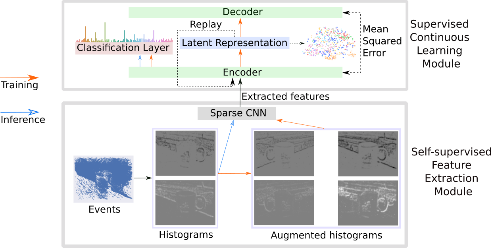

**Please send a request to vadym.gryshchuk@protonmail.com if you want to access code.**

Lifelong learning is a long-standing aim for artificial agents that act in dynamic environments in which an agent needs to accumulate knowledge incrementally without forgetting previously learned representations. Contemporary methods for incremental learning from images are predominantly based on frame-based data recorded by conventional shutter cameras. We investigate methods for learning from data produced by event cameras and compare techniques to mitigate forgetting while learning incrementally. We propose a model that is composed of both, feature extraction and incremental learning. The feature extractor is utilized as a self-supervised sparse convolutional neural network that processes event-based data. The incremental learner uses a habituation-based method that works in tandem with other existing techniques. Our experimental results show that the combination of different existing techniques with our proposed habituation-based method can help avoid catastrophic forgetting even more, while learning incrementally from the features provided by the extraction module.

2022 Vadym Gryshchuk (vadym.gryshchuk@protonmail.com)

Published in [Neurocomputing](https://doi.org/10.1016/j.neucom.2022.05.101)

Part of the research conducted in
[Master Thesis](https://www.inf.uni-hamburg.de/en/inst/ab/wtm/research/software.html) and for [ESANN 2021](https://www.esann.org/sites/default/files/proceedings/2021/ES2021-146.pdf)


The following figure illustrates the architecture:



---
```
@article{GRYSHCHUK20221063,
title = {Go ahead and do not forget: Modular lifelong learning from event-based data},
journal = {Neurocomputing},
volume = {500},
pages = {1063-1074},
year = {2022},
issn = {0925-2312},
doi = {https://doi.org/10.1016/j.neucom.2022.05.101},
url = {https://www.sciencedirect.com/science/article/pii/S0925231222006865},
author = {Vadym Gryshchuk and Cornelius Weber and Chu Kiong Loo and Stefan Wermter},
keywords = {Lifelong learning, Habituation, Event-based data, Bio-inspired artificial intelligence},
abstract = {Lifelong learning is a long-standing aim for artificial agents that act in dynamic environments in which an agent needs to accumulate knowledge incrementally without forgetting previously learned representations. Contemporary methods for incremental learning from images are predominantly based on frame-based data recorded by conventional shutter cameras. We investigate methods for learning from data produced by event cameras and compare techniques to mitigate forgetting while learning incrementally. We propose a model that is composed of both, feature extraction and incremental learning. The feature extractor is utilized as a self-supervised sparse convolutional neural network that processes event-based data. The incremental learner uses a habituation-based method that works in tandem with other existing techniques. Our experimental results show that the combination of different existing techniques with our proposed habituation-based method can help avoid catastrophic forgetting even more, while learning incrementally from the features provided by the extraction module.}
}
```
